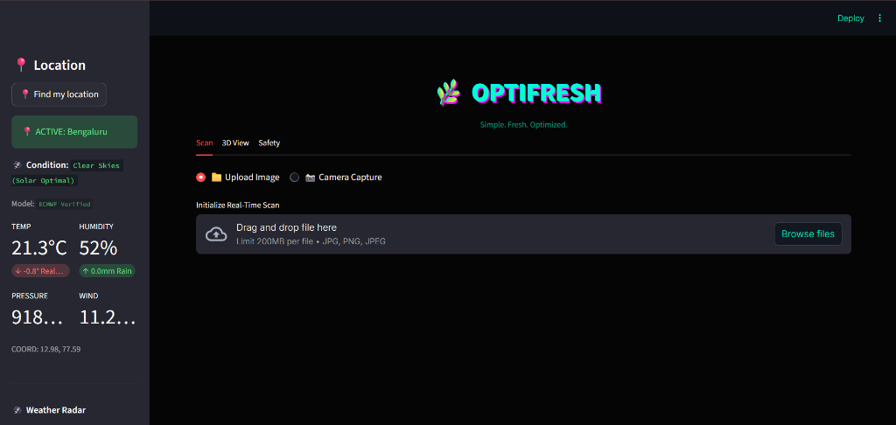

# 🌿 OPTIFRESH: Advanced Bio‑Molecular Food Safety Intelligence

[](https://www.python.org/)
[](https://streamlit.io/)

> **OPTIFRESH** – a state‑of‑the‑art, AI‑powered food safety and freshness analyzer that brings laboratory‑grade diagnostics to your kitchen. It fuses computer vision, 3D topology mapping, and stochastic decay modeling to deliver hyper‑accurate, actionable insights.

---

## 🎯 Vision

Food waste and safety are global challenges. **OPTIFRESH** replaces guesswork with scientific certainty, empowering anyone to make informed decisions about the edibility and shelf‑life of their food.

---

## 🧬 Core Intelligence Engines

| Engine | Function | Tech Stack |
| :--- | :--- | :--- |
| **Vision Engine** | Fine‑grained identification \u0026 classification | YOLOv8 + CLIP |
| **Holo Engine** | 3D structural health \u0026 turgor mapping | Depth‑MiDAS + Plotly 3D |
| **Spoilage Engine** | Biological decay \u0026 pathogen detection | Stochastic Physics Models |
| **Sensory Engine** | Digital palate (crunch, sweetness, acidity) | Bio‑Aesthetic Heuristics |
| **Economics Engine** | Real‑time market valuation (mandi rates) | Dynamic Pricing Logic |
| **Logic Engine** | Protocol‑based safety veto \u0026 mode switching | Consensus Safety Logic |

---

## ✨ Key Features

### 1️⃣ Molecular Bio‑Scan
Deep‑learning suite that identifies items and detects early‑stage spoilage using a multi‑model AI consensus (Vision Transformer \u0026 CLIP).

### 2️⃣ 🛡️ 3D Advanced Scan (Holographic View)
Generates a 3D mesh of the object to analyze structural integrity:
- **Surface Health** – skin turgor \u0026 cellular wall analysis
- **Nutrient Density** – energy distribution heat‑mapping
- **Risk \u0026 Stress** – pathogen cluster prediction \u0026 fracture mapping

### 3️⃣ 🔮 Predictive Safety Forecast
Stochastic life‑cycle forecasting based on:
- **Environmental Awareness** – real‑time IP‑based weather sync (temp/humidity)
- **Surgical Mode** – accelerated decay detection for cut/bitten items
- **Critical Failure Countdown** – physics‑based “Time‑to‑Death” estimation

### 4️⃣ 🦠 Pathogen Intelligence
Knowledge base with clinical insights into detected molds (Penicillium, Aspergillus, Rhizopus) and associated health risks.

### 5️⃣ 🔊 Interactive Diagnostics
- **AI Voice Briefings** – instant audio diagnostics for safety alerts
- **Smart Reports** – professional, shareable PDF safety certificates

---

## 📦 Installation \u0026 Setup

```bash
# 1️⃣ Clone the repository
git clone https://github.com/Sameer8549/optifresh.git
cd optifresh

# 2️⃣ Install Python dependencies
pip install -r requirements.txt

# 3️⃣ (Optional) Create a virtual environment
python -m venv .venv && .venv\\Scripts\\activate

# 4️⃣ Launch the app
streamlit run streamlit_app.py
```

> **Tip:** Use the provided `run_optifresh.bat` (generated automatically) to perform the above steps with a single double‑click.

---

## 🚀 Quick Start
1. Open the URL shown in the terminal (e.g., `http://localhost:8503`).
2. Upload a high‑resolution image of your food item.
3. Explore the **Bio‑Scan**, **3D View**, **Safety**, and **Report** tabs.
4. Download the PDF certificate or listen to the AI voice briefing.

---

## 📸 Screenshots \u0026 Demo



---

## 🛠️ Technology Stack

- **Frontend**: Streamlit (custom dark‑mode UI with glassmorphism accents)
- **Computer Vision**: OpenCV, Ultralytics YOLOv8
- **AI Models**: HuggingFace Transformers (CLIP, ViT, BLIP)
- **3D Visualization**: Plotly, Depth‑MiDAS
- **Physics Engine**: Stochastic biological decay modeling
- **Data**: Pandas, Polars for fast analytics

---

## 📚 Documentation
- **API Reference** – `docs/api.md` (auto‑generated with MkDocs)
- **User Guide** – `docs/user_guide.md`
- **Developer Guide** – `docs/dev_guide.md`

---

## 🤝 Contributing
We welcome contributions! Please read our [CONTRIBUTING.md](CONTRIBUTING.md) for guidelines on:
- Reporting bugs
- Suggesting new features
- Submitting pull requests

---

## � Contact
**Author:** ABDUL SAMEER – [GitHub](https://github.com/Sameer8549) • [LinkedIn](https://www.linkedin.com/in/abdulsameer9/)
**Support:** email `abdulsameer63167@gmail.com`

---

*Developed with ❤️ for food safety and waste reduction.*
